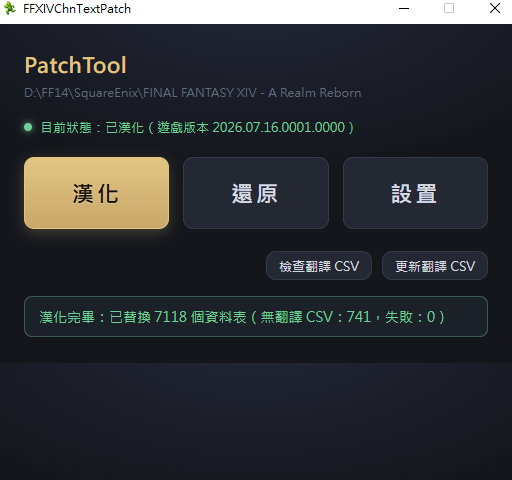

# FFXIV Translation Patch Tool

FFXIV 國際服的中文漢化器。以 C#/.NET 10（WPF + Blazor Hybrid）重寫，程式碼在 [`dotnet/`](dotnet/README.md)。



相較於上游原版：
1. 針對 5.5X 以後版本修正中文字庫補丁。
2. 使用 CSV（修改過的 SaintCoinach 輸出）進行漢化，**僅支援 CSV 模式**（中國服檔案 / 漢化覆蓋檔模式已移除）。
3. 刪除原版 exe 中與 teemo 連線的部分。
4. 以 C#/.NET 重寫，含 `--selftest` 二進位格式自檢與翻譯 CSV 檢查工具。

## 授權與溯源

本專案以 [GNU GPLv3](LICENSE) 授權。.NET 版移植自 [GpointChen/FFXIVChnTextPatch-GP](https://github.com/GpointChen/FFXIVChnTextPatch-GP)（Java Swing 版，其前身為 yumao 的 FFXIVChnTextPatch，2019-09-01 開源），為其衍生著作，沿用 GPLv3。原 Java 原始碼已自工作目錄移除，可在本 repo 的 git 歷史（`dotnet10-upgrade` 分支之前的 `src/`）或上游專案取得。

- `resource/rawexd/` 翻譯資料部分合併自 [Souma-Sumire/FFXIVChnTextPatch-Souma](https://github.com/Souma-Sumire/FFXIVChnTextPatch-Souma)（GPL-3.0，簡體），**並非直接沿用其 CSV**：合併時經簡轉繁與台灣用語轉換（含 FFXIV 專屬詞彙校訂），並持續由本專案人工編輯、修訂為適合台灣玩家的漢化用字；既有的本地翻譯在更新時一律保留。
- `resource/opencc/` 字典檔取自 [OpenCC](https://github.com/BYVoid/OpenCC)（Apache-2.0）；其中 `GPPhrases.txt` 是 GP 版的 FFXIV 簡繁例外詞彙表，轉自本 repo git 歷史中的 `resource/nlpcn/traditional.txt`（GPLv3）。

## 發佈檔案

每個 [Release](https://github.com/dks50217/FFXIVChnTextPatch-MC/releases) 會有三個檔案：

| 檔案 | 內容 | 給誰用 |
|------|------|--------|
| `FFXIVChnTextPatch.exe` | 單檔執行檔（自帶 .NET Runtime），自己漢化用 | 想自己備份、隨時還原、之後用「更新翻譯 CSV」的人 |
| `rawexd-opencc.zip` | 翻譯文本（`resource/rawexd` CSV）＋ 簡繁字典（`resource/opencc`） | 配合上面的 exe；缺翻譯檔時 exe 會提示自動下載這包 |
| `YYYYMMDDXX_CHT.zip` | **已漢化完成的六個 index/dat 檔** | 只想直接玩、不想跑漢化流程的人 |

兩種使用方式，擇一即可：

### A. 用 exe 自己漢化（可還原、可更新翻譯）

`FFXIVChnTextPatch.exe` 是單檔、直接下載即可執行（需 Windows + WebView2 Runtime）。首次執行若偵測不到翻譯 CSV，會跳出提示，一鍵下載 `rawexd-opencc.zip` 並解壓到 `resource/`（不需 git）。

> 字體檔（`resource/font`，約 248MB）太大不含在自動下載內。要「替換字體」請自行到本 repo 下載字體檔放進 `resource/font`；設置頁勾了替換字體但缺檔時會有提示。

### B. 直接套用漢化好的檔案（最快、不能用工具還原）

下載 `YYYYMMDDXX_CHT.zip`（`YYYYMMDDXX` 是遊戲版本號，`_CHT` 表繁中），解壓後把裡面的六個檔案覆蓋到遊戲目錄：

```
<遊戲根目錄>\game\sqpack\ffxiv\
```

覆蓋前建議自行備份那六個檔。這種方式沒有經過工具備份，**不能用程式的「還原」還原**；遊戲改版後直接刪掉覆蓋的檔、讓官方更新即可，或改用方式 A。

## 使用（方式 A 詳細步驟）

從本專案的 [Releases](https://github.com/dks50217/FFXIVChnTextPatch-MC/releases) 下載，或自行編譯。需要 Windows + WebView2 Runtime。

1. 開啟 `FFXIVChnTextPatch.exe`，首次啟動會進入「漢化設置」
2. 「遊戲路徑」：選擇 FFXIV 遊戲根目錄（目錄內須有 `game/ffxiv_dx11.exe`，預設名為 `FINAL FANTASY XIV ONLINE`）
3. 「原始語言」：想要覆蓋遊戲中的哪種語言（建議日文，覆蓋其他語言不保證沒問題）
4. 視需求勾選「替換字體」「替換文本」，點「確認」
5. 回到主畫面點「漢化」；「還原」可隨時回復備份，不需任何設定

漢化前會自動備份六個 index/dat 檔到 `backup/`。注意事項：

- 為避免遊戲更新時出問題，建議每次更新前先「還原」，更新完成後再重新漢化。
- 程式會拒絕在已漢化的檔案上重複漢化（避免備份被已漢化的檔案覆蓋導致無法還原）。
- 主畫面的「檢查翻譯 CSV」可檢查 `resource/rawexd` 翻譯檔的格式與覆蓋率。
- 主畫面的「更新翻譯 CSV」一鍵從 [Souma 上游](https://github.com/Souma-Sumire/FFXIVChnTextPatch-Souma) 下載最新翻譯（需要 git）、簡轉繁（含台灣用語，等同 OpenCC s2twp）後逐儲存格合併：**本地已有的翻譯永遠不會被覆蓋**，只補空格、新列與新檔。合併前會先備份到 `backup/rawexd-before-update.zip`。也可用 `FFXIVChnTextPatch.exe --update` 從命令列執行（進度見 `debug.log`）。
- 用語轉換的例外與自訂譯法寫在 `resource/opencc/UserPhrases.txt`（格式見檔內說明，優先權最高），影響之後每次「更新翻譯 CSV」新補進來的文字。

## 編譯

需要 .NET 10 SDK（Windows），詳見 [`dotnet/README.md`](dotnet/README.md)。

```bash
cd dotnet/FFXIVChnTextPatch
dotnet build
dotnet run
```

發佈單一執行檔：

```bash
dotnet publish -c Release -r win-x64 --self-contained -p:PublishSingleFile=true -p:IncludeNativeLibrariesForSelfExtract=true
```

`wwwroot`（UI）已內嵌進 exe，發佈只需 `FFXIVChnTextPatch.exe` 單檔即可執行。`conf/`、`resource/` 為外部檔：`conf/global.properties` 首次執行會自動建立，翻譯檔可由程式提示下載（見上方「發佈檔案」）。

舊 Java 版的編譯筆記可參考[這裡](https://hackmd.io/@GpointChen/SJi_gv-ad)（原始碼在 git 歷史中）。

## 翻譯資源

- `resource/rawexd/` — CSV 翻譯檔（每個 EXD 表一個檔案）。各 CSV 對應遊戲內哪些文本，可參考 [Souma 版的 CSV 文件說明](https://github.com/Souma-Sumire/FFXIVChnTextPatch-Souma/wiki/CSV%E6%96%87%E4%BB%B6)。
- `resource/font/` — 替換字體（`.fdt` + `.tex`）。
- 設置頁的「跳過的資料表」可勾選漢化時要跳過的表（含中文說明、可搜尋），也可直接編輯 `conf/global.properties` 的 `SkipFiles`（`|` 分隔，格式如 `exd/quest`）。
- `conf/exd-names.csv` — 表名對應遊戲內文本位置的說明檔，用於設置頁清單、漢化進度與檢查報告。

## 免責聲明（沿自原項目）

- 本程式以修改客戶端的方式載入中文資源，此舉違反官方規則，使用即表示自行承擔一切後果。
- 本專案僅供學習與技術交流使用，嚴禁任何商業用途。
